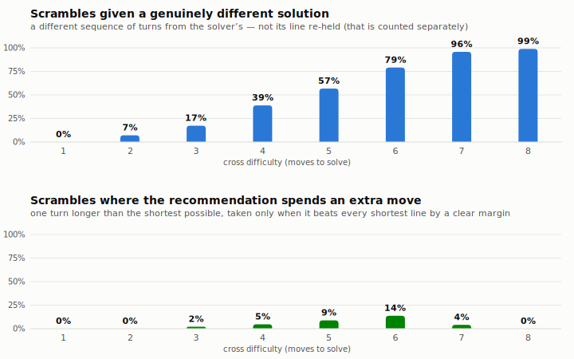

# Cube Trainer

Train to bring down your speed cubing time.

## Cross Trainer

Generate a cross at a difficulty level of your choosing and get the optimal solution to help guide you.

### Experimental: a friendlier line than "optimal"

The solver returns whichever shortest solution its search finds first, and that search tries faces in a fixed order — F, R, U, B, L, D. So its answer leans on **F and B**, the two worst faces for your hands, and it never says which face to hold at the front.

The trainer now enumerates *every* shortest solution (plus every one-move-longer one), scores each across all four ways of holding the cube, and shows the friendliest next to the solver's. Ergonomics come from [Trangium's algSpeed](https://github.com/trangium/trangium.github.io), which simulates grips and fingertricks — on its scale an R turn costs 0.80 and a B turn 3.50, exactly the bias the search order was blind to.

<picture>
  <source media="(prefers-color-scheme: dark)" srcset="docs/img/cross-ranker-impact-dark.svg">
  
</picture>

- **Different solutions get commoner as the cross gets harder.** At 1–2 moves the shortest line is close to forced, so there's nothing to swap it for. By 7–8 moves there are thousands of equally short lines and the solver's pick is almost never the nicest — 99% of level-8 scrambles get a different one.
- **Extra moves are rare — the bottom panel is nearly empty, and that's the finding, not a broken chart.** The premise was that a 9-move cross might beat an 8-move one by being smoother. Sometimes it does (it peaks at 14% on 6-move crosses), but the extra move costs turning time, and across all 8000 scrambles it earns its keep only 4% of the time. Allowing *two* or three is worse still, so the tool never does. (Extra moves **do** pay in XCross, where they buy a finished F2L pair — a plain cross only buys smoothness, which rarely covers the cost.)

Both panels share one 0–100% scale, so they're honestly comparable.

**The third result isn't in the charts, and it's the best one.** On another 35% of scrambles the recommendation *is* the solver's line — just held with a different face in front. Same turns, better angle: `L D L` becomes `R D R` by holding blue. It costs nothing and it's the mirror image of the top chart — 57–68% of easy crosses vs ~1% of 8-move ones. Where the line can't be improved, the hold usually can.

The panel is marked **experimental** in the UI: it's an unproven model of *someone else's* hands, so the solver's line stays the primary answer. Dev tools include a blind A/B vote for testing it against real fingers. Full analysis and caveats: [`docs/improvement-ideas.md`](docs/improvement-ideas.md) §5.

<details>
<summary>Exact numbers</summary>

Regenerate with `node scripts/analyze-cross-ranking.mjs --all --emit-charts docs/img` — the same run asserts that every recommended line genuinely solves the cross, so the figures can't drift from the code. Raw values are in [`docs/img/cross-ranker-impact.json`](docs/img/cross-ranker-impact.json).

| Cross difficulty | Different solution | Extra move | Solver's line, better hold |
|---|---|---|---|
| 1 move | 0.0% | 0.0% | 56.9% |
| 2 moves | 7.1% | 0.0% | 68.0% |
| 3 moves | 17.3% | 2.1% | 58.5% |
| 4 moves | 38.9% | 4.7% | 44.7% |
| 5 moves | 56.8% | 8.8% | 32.5% |
| 6 moves | 79.1% | 13.7% | 15.6% |
| 7 moves | 95.8% | 4.1% | 3.4% |
| 8 moves | 98.9% | 0.0% | 1.1% |

</details>

## Oll Two Sided Recognition Trainer
Practice your recognization to shorten your recognition time.

## Deployment

Hosted on Cloudflare **Workers** (with static assets) — not Pages, despite the similar dashboard. Merge to `main` → auto-build and deploy. Pushing any other branch publishes a preview at `https://<branch>-cross-trainer.russell-dodd.workers.dev` at 0% production traffic. See `CLAUDE.md` for full deployment details.

## Development server

Run `ng serve` for a dev server. Navigate to `http://localhost:4200/`. The app will automatically reload if you change any of the source files.

## Code scaffolding

Run `ng generate component component-name` to generate a new component. You can also use `ng generate directive|pipe|service|class|guard|interface|enum|module`.

## Build

Run `ng build` to build the project, into `dist/`. Angular 20 builds production by default — there is no `--prod` flag any more.

## Running unit tests

Run `ng test` to execute the unit tests via [Karma](https://karma-runner.github.io). The suite is green; any failure is a real one.

## Analysis scripts

The cube analysis lives outside the app, in `scripts/`, and is self-validating — each script asserts its cube maths against the vendored solver before reporting.

```bash
node scripts/analyze-cross-ranking.mjs            # what the experimental ranker changes
node scripts/analyze-pair-tracking.mjs            # first-pair tracking difficulty model
node scripts/analyze-line-votes.mjs <votes.csv>   # blind A/B votes exported from dev tools
```

## Further help

To get more help on the Angular CLI use `ng help` or go check out the [Angular CLI README](https://github.com/angular/angular-cli/blob/master/README.md).
